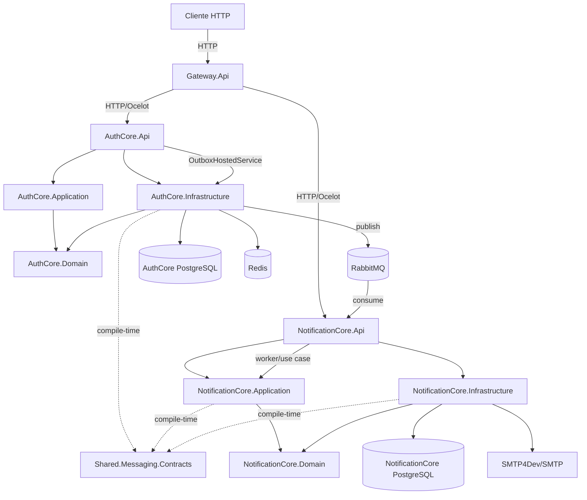

# AuthCore


AuthCore é uma solução backend em .NET 10 para autenticação, gestão de usuários e notificações transacionais. A base está organizada por serviços backend, API Gateway, mensageria assíncrona e camadas internas com influência de Clean Architecture e DDD tático.

O objetivo é oferecer um núcleo de autenticação robusto para aplicações backend, mantendo regras de negócio no domínio, casos de uso na aplicação, detalhes técnicos na infraestrutura e comunicação entre serviços por contratos explícitos.

## Sumário

- [Funcionalidades](#funcionalidades)
- [Serviços](#serviços)
- [Tecnologias](#tecnologias)
- [Arquitetura](#arquitetura)
- [Requisitos](#requisitos)
- [Instalação](#instalação)
- [Uso](#uso)
- [Configuração](#configuração)
- [Autenticação](#autenticação)
- [Endpoints principais](#endpoints-principais)
- [Testes](#testes)
- [Estrutura do projeto](#estrutura-do-projeto)
- [Licença](#licença)

## Funcionalidades

- Registro de usuários com validação de dados e senha.
- Verificação de e-mail por código OTP.
- Login por sessão com cookies `HttpOnly`.
- Login token-based com access token JWT e refresh token.
- Autenticação híbrida para Browser/PWA com sessão server-side e JWT curto em cookie `HttpOnly`.
- Renovação e revogação de sessões.
- Logout da sessão atual, logout por token e logout global.
- Listagem e revogação de sessões ativas do usuário.
- Consulta e atualização do perfil autenticado.
- Troca de senha.
- Exclusão de usuário autenticado.
- Rate limiting de rotas sensíveis no Gateway.
- Proteção CSRF para mutações autenticadas por cookie.
- Health checks por serviço.
- Publicação assíncrona de solicitações de notificação pelo AuthCore.
- Consumo, registro, renderização e despacho de notificações transacionais pelo NotificationCore.
- SMTP local para testes de envio de e-mail em desenvolvimento.

## Serviços

- `Gateway.Api`: API Gateway com Ocelot, autenticação JWT, suporte a JWT via cookie `HttpOnly`, proteção CSRF para mutações por cookie e roteamento para os serviços internos.
- `AuthCore.Api`: serviço de autenticação e usuários.
- `NotificationCore.Api`: serviço de notificações transacionais, templates e envio de e-mail.
- `Shared.Messaging.Contracts`: contratos compartilhados de mensageria e utilitários de payload sensível.

## Tecnologias

- .NET 10
- ASP.NET Core Web API
- Ocelot
- PostgreSQL 17
- Redis 7
- RabbitMQ 3
- SMTP4Dev
- Docker e Docker Compose
- Npgsql
- FluentMigrator
- BCrypt.Net
- JWT Bearer Authentication
- xUnit
- Swagger/OpenAPI

## Arquitetura

A solução organiza serviços backend com separação de responsabilidades e camadas internas por contexto de negócio:



Responsabilidades principais:

- `Gateway.Api`: borda pública em Docker Compose, roteamento, rate limiting, validação JWT para rotas protegidas e suporte ao fluxo Browser/PWA com JWT em cookie `HttpOnly`.
- `AuthCore.Api`: controllers HTTP, contratos JSON, autenticação, autorização, Swagger e health checks.
- `AuthCore.Application`: orquestração dos casos de uso de autenticação e usuários.
- `AuthCore.Domain`: agregados, entidades, value objects, invariantes, eventos e contratos centrais de autenticação.
- `AuthCore.Infrastructure`: persistência PostgreSQL, Redis, criptografia, tokens, migrações, Outbox e publicação RabbitMQ.
- `NotificationCore.Api`: controllers HTTP administrativos, contratos JSON, Swagger e health checks.
- `NotificationCore.Application`: orquestração de consultas, busca e solicitações de envio de notificações.
- `NotificationCore.Domain`: entidades, value objects, enums e regras de notificação.
- `NotificationCore.Infrastructure`: persistência PostgreSQL, consumo RabbitMQ, Inbox, templates, renderização e envio SMTP.
- `Shared.Messaging.Contracts`: mensagens compartilhadas entre serviços.
- `tests`: testes unitários de domínio, aplicação e testes de integração por serviço.

## Requisitos

Para executar localmente:

- [.NET SDK 10](https://dotnet.microsoft.com/download/dotnet/10.0)
- Docker
- Docker Compose ou plugin `docker compose`
- Bash, para usar o script `run.sh`

## Instalação

Clone o repositório e acesse a pasta do projeto:

```bash
git clone <url-do-repositorio>
cd auth_core
```

Restaure as dependências:

```bash
dotnet restore AuthCore.sln
```

Compile a solução:

```bash
dotnet build AuthCore.sln
```

## Uso

O projeto possui um script principal para facilitar a execução local.

### Executar AuthCore local com infraestrutura em Docker

```bash
./run.sh dev
```

Esse comando sobe PostgreSQL, Redis, RabbitMQ e SMTP4Dev via Docker Compose e executa `AuthCore.Api` localmente com o profile `http`.

O AuthCore local fica disponível em:

```text
http://localhost:5012
```

Em ambiente de desenvolvimento, o Swagger do AuthCore fica disponível em:

```text
http://localhost:5012/swagger
```

### Executar AuthCore com hot reload

```bash
./run.sh watch
```

### Subir apenas a infraestrutura

```bash
./run.sh infra
```

Esse comando sobe bancos, Redis, RabbitMQ e SMTP4Dev. Ele não executa as APIs.

### Executar toda a aplicação com Docker Compose

```bash
./run.sh docker
```

Nesse modo, o ponto de entrada público é o Gateway:

```text
http://localhost:8080
```

O AuthCore também fica exposto diretamente para depuração local:

```text
http://localhost:8081
```

O NotificationCore roda dentro da rede Docker e é acessado pelo Gateway.

### Encerrar containers

```bash
./run.sh down
```

## Configuração

As configurações de desenvolvimento estão em:

- `src/Backend/.env.development.example`, modelo versionado sem segredos
- `src/Backend/.env.development`, arquivo local ignorado pelo Git
- `src/Backend/AuthCore/AuthCore.Api/appsettings.Development.json`
- `src/Backend/NotificationCore/NotificationCore.Api/appsettings.Development.json`
- `src/Backend/Gateway/Gateway.Api/ocelot.json`

Antes de executar o projeto pela primeira vez, crie o arquivo local a partir do modelo e preencha os valores vazios quando necessário:

```bash
cp src/Backend/.env.development.example src/Backend/.env.development
```

Serviços padrão em desenvolvimento:

| Serviço | Host | Porta |
| --- | --- | --- |
| Gateway Docker | `localhost` | `8080` |
| AuthCore Docker | `localhost` | `8081` |
| AuthCore local | `localhost` | `5012` |
| PostgreSQL AuthCore | `localhost` | `5432` |
| PostgreSQL NotificationCore | `localhost` | `5433` |
| Redis | `localhost` | `6379` |
| RabbitMQ | `localhost` | `5672` |
| RabbitMQ Management | `localhost` | `15672` |
| SMTP local | `localhost` | `1025` |
| SMTP4Dev UI | `localhost` | `1080` |

Credenciais, senhas e chave de assinatura JWT devem ficar no `.env.development` local ou no mecanismo de segredos do ambiente de deploy. O `docker-compose.yml` apenas referencia essas variáveis.

## Autenticação

O projeto possui dois fluxos de autenticação para desenvolvimento e validação local.

### Browser/PWA: sessão server-side + JWT curto em cookie

Esse é o fluxo recomendado para aplicações browser. O login em `POST /api/auth/session/login` cria uma sessão server-side no AuthCore e emite cookies de autenticação:

| Cookie | HttpOnly | Uso |
| --- | --- | --- |
| `sid` | Sim | Identificador opaco da sessão server-side |
| `at` | Sim | JWT curto usado pelo Gateway para autenticar rotas protegidas |
| `XSRF-TOKEN` | Não | Token CSRF que o frontend lê e envia no header `X-CSRF-TOKEN` |

O JWT do cookie `at` não é retornado no corpo da resposta e não precisa ser lido por JavaScript. Em requisições para rotas protegidas via Gateway, o navegador envia os cookies automaticamente com `credentials: "include"`. O Gateway valida o JWT de forma stateless e encaminha internamente `Authorization: Bearer <jwt>` para o serviço downstream.

Para métodos mutáveis autenticados por cookie, o Gateway exige CSRF válido:

- exige CSRF: `POST`, `PUT`, `PATCH`, `DELETE`
- não exige CSRF: `GET`, `HEAD`, `OPTIONS`

O token CSRF é assinado e vinculado ao `sid`. A validação não é apenas comparação simples entre cookie e header.

As rotas `/api/auth/...` continuam sob responsabilidade do AuthCore. Isso permite que login, refresh, logout e rotas públicas de autenticação usem as validações próprias do AuthCore, incluindo sessão por cookie e CSRF.

### API/mobile: Authorization Bearer

Clientes API, mobile ou integrações podem usar o fluxo token-based em `POST /api/auth/token/login`. Nesse caso, o access token é retornado no corpo da resposta e deve ser enviado como:

```http
Authorization: Bearer <access-token>
```

Quando `Authorization: Bearer` está presente, ele tem prioridade sobre qualquer cookie `at` enviado junto na requisição. Esse fluxo não exige CSRF.

### Teste manual do fluxo Browser/PWA

1. Suba a aplicação completa com Docker Compose.
2. Acesse o Swagger do AuthCore em `http://localhost:8081/swagger`.
3. Registre e verifique um usuário.
4. Faça login em `POST /api/auth/session/login`.
5. No navegador, abra DevTools > Application > Cookies e confirme `sid`, `at` e `XSRF-TOKEN`.
6. Confirme que `sid` e `at` estão com `HttpOnly`.
7. Chame `GET http://localhost:8080/api/users/profile` com `credentials: "include"`.
8. Para `POST`, `PUT`, `PATCH` ou `DELETE` via Gateway, envie também o header `X-CSRF-TOKEN` com o valor do cookie `XSRF-TOKEN`.

Exemplo no console do navegador:

```javascript
const csrf = document.cookie
  .split("; ")
  .find(value => value.startsWith("XSRF-TOKEN="))
  ?.split("=")[1];

await fetch("http://localhost:8080/api/users/profile", {
  method: "GET",
  credentials: "include"
});

await fetch("http://localhost:8080/api/users/change-password", {
  method: "PUT",
  credentials: "include",
  headers: {
    "Content-Type": "application/json",
    "X-CSRF-TOKEN": csrf
  },
  body: JSON.stringify({
    currentPassword: "Senha@123456",
    newPassword: "NovaSenha@123456"
  })
});
```

## Endpoints principais

Quando a aplicação completa está em Docker, prefira acessar as rotas publicadas pelo Gateway em `http://localhost:8080`.

### AuthCore

| Método | Rota | Descrição |
| --- | --- | --- |
| `POST` | `/api/auth/register` | Registra usuário pendente de verificação |
| `POST` | `/api/auth/verify-email` | Valida código de verificação de e-mail |
| `POST` | `/api/auth/resend-verification` | Reenvia código de verificação |
| `POST` | `/api/auth/session/login` | Autentica por sessão com cookie |
| `GET` | `/api/auth/session/me` | Retorna usuário da sessão atual |
| `GET` | `/api/auth/session/sessions` | Lista sessões ativas |
| `DELETE` | `/api/auth/session/sessions/{sid}` | Revoga uma sessão específica |
| `POST` | `/api/auth/session/logout` | Encerra sessão atual |
| `POST` | `/api/auth/session/logout-all` | Encerra todas as sessões |
| `POST` | `/api/auth/token/login` | Autentica por JWT e refresh token |
| `POST` | `/api/auth/token/refresh` | Renova uma sessão token-based |
| `POST` | `/api/auth/token/logout` | Revoga refresh token |
| `GET` | `/api/users/profile` | Consulta perfil autenticado |
| `PUT` | `/api/users/profile` | Atualiza perfil autenticado |
| `PUT` | `/api/users/change-password` | Altera senha |
| `DELETE` | `/api/users` | Exclui usuário autenticado |

`POST /api/auth/register` é a única entrada pública de autocadastro. Esse endpoint pertence ao `AuthController` e usa `RegisterUserUseCase` para criar usuário pendente de verificação, senha, verificação de e-mail e mensagem de Outbox na mesma transação.

`UserController` fica restrito às operações autenticadas de perfil, senha e exclusão. `POST /api/users` não é endpoint de registro público. Convite de usuário e criação administrativa multitenant estão fora do escopo atual e devem ser especificados futuramente como fluxos próprios.

### NotificationCore

| Método | Rota | Descrição |
| --- | --- | --- |
| `GET` | `/api/notifications/{id}` | Consulta uma notificação pelo identificador |
| `POST` | `/api/notifications/test-email` | Envia uma notificação de teste |

As rotas de `NotificationCore` publicadas pelo Gateway exigem autenticação. Clientes browser podem usar o cookie `at` emitido pelo fluxo de sessão; clientes API/mobile podem usar `Authorization: Bearer`.

### Health checks

| Método | Rota | Descrição |
| --- | --- | --- |
| `GET` | `/health` | Health check do Gateway |
| `GET` | `/authcore/health` | Health check do AuthCore via Gateway |
| `GET` | `/notificationcore/health` | Health check do NotificationCore via Gateway |
| `GET` | `/health` | Health check direto de cada API quando acessada fora do Gateway |

### Exemplo: registrar usuário via Gateway

```bash
curl -X POST http://localhost:8080/api/auth/register \
  -H "Content-Type: application/json" \
  -d '{
    "firstName": "Ana",
    "lastName": "Silva",
    "email": "ana.silva@example.com",
    "contact": "+5511999999999",
    "password": "Senha@123456",
    "confirmPassword": "Senha@123456"
  }'
```

Em desenvolvimento, a solicitação de verificação de e-mail é publicada pelo AuthCore e processada pelo NotificationCore quando a aplicação completa está em execução. As mensagens enviadas por SMTP local podem ser consultadas na UI do SMTP4Dev:

```text
http://localhost:1080
```

### Exemplo: verificar e-mail

```bash
curl -X POST http://localhost:8080/api/auth/verify-email \
  -H "Content-Type: application/json" \
  -d '{
    "email": "ana.silva@example.com",
    "code": "<codigo-otp>"
  }'
```

### Exemplo: login com token para API/mobile

```bash
curl -X POST http://localhost:8080/api/auth/token/login \
  -H "Content-Type: application/json" \
  -d '{
    "email": "ana.silva@example.com",
    "password": "Senha@123456"
  }'
```

### Exemplo: consultar perfil autenticado com Bearer

```bash
curl http://localhost:8080/api/users/profile \
  -H "Authorization: Bearer <access-token>"
```

### Exemplo: consultar perfil autenticado com cookies do browser

Depois do login em `POST /api/auth/session/login`, o navegador envia os cookies automaticamente quando a chamada usa credenciais:

```javascript
await fetch("http://localhost:8080/api/users/profile", {
  method: "GET",
  credentials: "include"
});
```

### Exemplo: enviar e-mail de teste

```bash
curl -X POST http://localhost:8080/api/notifications/test-email \
  -H "Content-Type: application/json" \
  -H "Authorization: Bearer <access-token>" \
  -d '{
    "recipient": "ana.silva@example.com",
    "correlationId": "manual-test-001"
  }'
```

## Testes

Execute todos os testes da solução:

```bash
./run.sh test
```

Ou diretamente com o .NET CLI:

```bash
dotnet test AuthCore.sln
```

Para executar testes por área:

```bash
dotnet test tests/AuthCore.Domain.UnitTests/AuthCore.Domain.UnitTests.csproj
dotnet test tests/AuthCore.Application.UnitTests/AuthCore.Application.UnitTests.csproj
dotnet test tests/AuthCore.IntegrationTests/AuthCore.IntegrationTests.csproj
dotnet test tests/NotificationCore.Domain.UnitTests/NotificationCore.Domain.UnitTests.csproj
dotnet test tests/NotificationCore.Application.UnitTests/NotificationCore.Application.UnitTests.csproj
dotnet test tests/NotificationCore.IntegrationTests/NotificationCore.IntegrationTests.csproj
dotnet test tests/Gateway.IntegrationTests/Gateway.IntegrationTests.csproj
```

## Estrutura do projeto

```text
.
├── AuthCore.sln
├── run.sh
├── src
│   ├── Backend
│   │   ├── docker-compose.yml
│   │   ├── AuthCore
│   │   │   ├── AuthCore.Api
│   │   │   ├── AuthCore.Application
│   │   │   ├── AuthCore.Domain
│   │   │   └── AuthCore.Infrastructure
│   │   ├── Gateway
│   │   │   └── Gateway.Api
│   │   └── NotificationCore
│   │       ├── NotificationCore.Api
│   │       ├── NotificationCore.Application
│   │       ├── NotificationCore.Domain
│   │       └── NotificationCore.Infrastructure
│   ├── Shared
│   │   └── Messaging.Contracts
│   └── Frontend
└── tests
    ├── AuthCore.Application.UnitTests
    ├── AuthCore.Domain.UnitTests
    ├── AuthCore.IntegrationTests
    ├── Gateway.IntegrationTests
    ├── NotificationCore.Application.UnitTests
    ├── NotificationCore.Domain.UnitTests
    └── NotificationCore.IntegrationTests
```

## Licença

Este projeto está licenciado sob a licença MIT. Consulte o arquivo [LICENSE](LICENSE) para mais detalhes.
