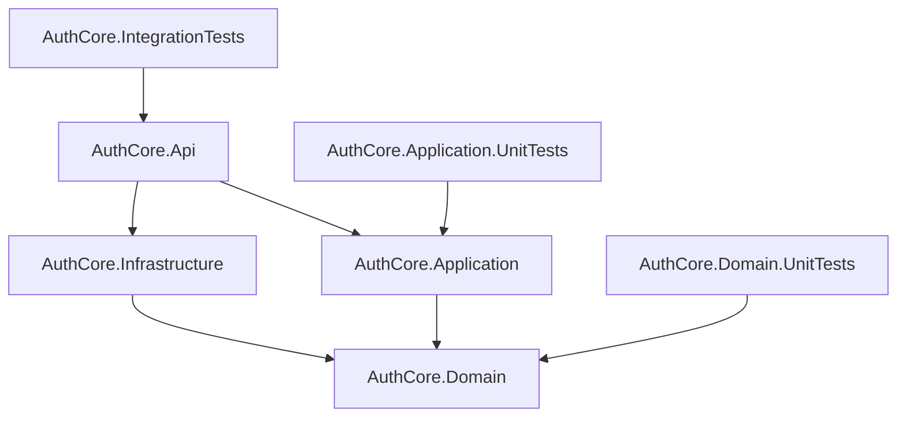

# AuthCore


AuthCore é uma API de autenticação e gestão de usuários desenvolvida em .NET 8. O projeto implementa registro, login, sessões, renovação de tokens, verificação de e-mail, troca de senha e gerenciamento de perfil com uma arquitetura em camadas inspirada em Clean Architecture e DDD tático.

O objetivo do projeto é servir como um núcleo de autenticação robusto para aplicações backend, mantendo regras de negócio no domínio, casos de uso na aplicação e detalhes técnicos isolados na infraestrutura.

## Sumário

- [Funcionalidades](#funcionalidades)
- [Tecnologias](#tecnologias)
- [Arquitetura](#arquitetura)
- [Requisitos](#requisitos)
- [Instalação](#instalação)
- [Uso](#uso)
- [Endpoints principais](#endpoints-principais)
- [Testes](#testes)
- [Estrutura do projeto](#estrutura-do-projeto)
- [Contribuição](#contribuição)
- [Licença](#licença)

## Funcionalidades

- Registro de usuários com validação de dados e senha.
- Verificação de e-mail por código OTP.
- Login por sessão com cookie HTTP.
- Login token-based com access token JWT e refresh token.
- Renovação e revogação de sessões.
- Logout da sessão atual, logout por token e logout global.
- Listagem e revogação de sessões ativas do usuário.
- Consulta e atualização do perfil autenticado.
- Troca de senha.
- Exclusão de usuário autenticado.
- Rate limiting de tentativas de login.
- Proteção CSRF para mutações autenticadas por cookie.
- Health check de banco, Redis e componentes de infraestrutura.
- Processamento assíncrono de verificações de e-mail via Outbox e sender de log em desenvolvimento.

## Tecnologias

- .NET 8
- ASP.NET Core Web API
- PostgreSQL 17
- Redis 7
- RabbitMQ 3, com configuração e container preparados para integração de mensageria
- Docker e Docker Compose
- Npgsql
- FluentMigrator
- BCrypt.Net
- JWT Bearer Authentication
- xUnit
- Swagger/OpenAPI

## Arquitetura

A solução segue uma arquitetura em camadas:



Responsabilidades principais:

- `AuthCore.Api`: controllers HTTP, contratos JSON, autenticação, autorização, Swagger e health checks.
- `AuthCore.Application`: orquestração dos casos de uso.
- `AuthCore.Domain`: agregados, entidades, value objects, invariantes, eventos e contratos centrais.
- `AuthCore.Infrastructure`: persistência PostgreSQL, Redis, configuração de RabbitMQ, criptografia, tokens, migrações e Outbox.
- `tests`: testes unitários de domínio, aplicação e testes de integração.

## Requisitos

Para executar localmente:

- [.NET SDK 8](https://dotnet.microsoft.com/download/dotnet/8.0)
- Docker
- Docker Compose ou plugin `docker compose`
- Bash, para usar o script `run.sh`

## Instalação

Clone o repositório e acesse a pasta do projeto:

```bash
git clone <url-do-repositorio>
cd auth_core
```

Restaure as dependências:

```bash
dotnet restore AuthCore.sln
```

Compile a solução:

```bash
dotnet build AuthCore.sln
```

## Uso

O projeto possui um script principal para facilitar a execução local.

### Executar API local com infraestrutura em Docker

```bash
./run.sh dev
```

Esse comando sobe PostgreSQL, Redis e RabbitMQ via Docker Compose e executa a API localmente com o profile `http`.

A API fica disponível em:

```text
http://localhost:5012
```

Em ambiente de desenvolvimento, o Swagger fica disponível em:

```text
http://localhost:5012/swagger
```

### Executar com hot reload

```bash
./run.sh watch
```

### Subir apenas a infraestrutura

```bash
./run.sh infra
```

### Executar toda a aplicação com Docker Compose

```bash
./run.sh docker
```

Por padrão, nesse modo a API fica exposta em:

```text
http://localhost:8080
```

### Encerrar containers

```bash
./run.sh down
```

## Configuração

As configurações de desenvolvimento estão em:

- `src/Backend/.env.development`
- `src/Backend/AuthCore/AuthCore.Api/appsettings.Development.json`

Serviços padrão em desenvolvimento:

| Serviço | Host | Porta |
| --- | --- | --- |
| API local | `localhost` | `5012` |
| API Docker | `localhost` | `8080` |
| PostgreSQL | `localhost` | `5432` |
| Redis | `localhost` | `6379` |
| RabbitMQ | `localhost` | `5672` |
| RabbitMQ Management | `localhost` | `15672` |

As credenciais presentes nos arquivos de desenvolvimento são apenas defaults locais. Para ambientes reais, configure segredos por variáveis de ambiente ou pelo mecanismo de configuração do ambiente de deploy.

## Endpoints principais

| Método | Rota | Descrição |
| --- | --- | --- |
| `POST` | `/api/auth/register` | Registra usuário pendente de verificação |
| `POST` | `/api/auth/verify-email` | Valida código de verificação de e-mail |
| `POST` | `/api/auth/resend-verification` | Reenvia código de verificação |
| `POST` | `/api/auth/session/login` | Autentica por sessão com cookie |
| `GET` | `/api/auth/session/me` | Retorna usuário da sessão atual |
| `GET` | `/api/auth/session/sessions` | Lista sessões ativas |
| `DELETE` | `/api/auth/session/sessions/{sid}` | Revoga uma sessão específica |
| `POST` | `/api/auth/session/logout` | Encerra sessão atual |
| `POST` | `/api/auth/session/logout-all` | Encerra todas as sessões |
| `POST` | `/api/auth/token/login` | Autentica por JWT e refresh token |
| `POST` | `/api/auth/token/refresh` | Renova uma sessão token-based |
| `POST` | `/api/auth/token/logout` | Revoga refresh token |
| `POST` | `/api/users` | Registra usuário |
| `GET` | `/api/users/profile` | Consulta perfil autenticado |
| `PUT` | `/api/users/profile` | Atualiza perfil autenticado |
| `PUT` | `/api/users/change-password` | Altera senha |
| `DELETE` | `/api/users` | Exclui usuário autenticado |
| `GET` | `/health` | Health check da aplicação |

### Exemplo: registrar usuário

```bash
curl -X POST http://localhost:5012/api/auth/register \
  -H "Content-Type: application/json" \
  -d '{
    "firstName": "Ana",
    "lastName": "Silva",
    "email": "ana.silva@example.com",
    "contact": "+5511999999999",
    "password": "Senha@123456",
    "confirmPassword": "Senha@123456"
  }'
```

Em desenvolvimento, o código OTP de verificação é registrado nos logs da API pelo `LoggingEmailSender`.

### Exemplo: verificar e-mail

```bash
curl -X POST http://localhost:5012/api/auth/verify-email \
  -H "Content-Type: application/json" \
  -d '{
    "email": "ana.silva@example.com",
    "code": "<codigo-otp>"
  }'
```

### Exemplo: login com token

```bash
curl -X POST http://localhost:5012/api/auth/token/login \
  -H "Content-Type: application/json" \
  -d '{
    "email": "ana.silva@example.com",
    "password": "Senha@123456"
  }'
```

### Exemplo: consultar perfil autenticado

```bash
curl http://localhost:5012/api/users/profile \
  -H "Authorization: Bearer <access-token>"
```

## Testes

Execute todos os testes da solução:

```bash
./run.sh test
```

Ou diretamente com o .NET CLI:

```bash
dotnet test AuthCore.sln
```

Para executar apenas testes de domínio:

```bash
dotnet test tests/AuthCore.Domain.UnitTests/AuthCore.Domain.UnitTests.csproj
```

## Estrutura do projeto

```text
.
├── AuthCore.sln
├── run.sh
├── src
│   └── Backend
│       ├── docker-compose.yml
│       └── AuthCore
│           ├── AuthCore.Api
│           ├── AuthCore.Application
│           ├── AuthCore.Domain
│           └── AuthCore.Infrastructure
└── tests
    ├── AuthCore.Application.UnitTests
    ├── AuthCore.Domain.UnitTests
    ├── AuthCore.IntegrationTests
    └── AuthCore.ArchitectureTests
```

`AuthCore.ArchitectureTests` existe hoje apenas como diretório reservado para testes arquiteturais futuros.

## Contribuição

1. Crie uma branch a partir da branch principal.
2. Mantenha as responsabilidades de cada camada.
3. Preserve regras de negócio dentro do domínio.
4. Use casos de uso na camada `Application` para orquestração.
5. Mantenha controllers finos na camada `Api`.
6. Use SQL explícito e Npgsql na infraestrutura.
7. Adicione ou atualize testes quando alterar comportamento.
8. Execute `dotnet build AuthCore.sln` e `dotnet test AuthCore.sln` antes de abrir um pull request.

## Licença

Este projeto está licenciado sob a licença MIT. Consulte o arquivo [LICENSE](LICENSE) para mais detalhes.
