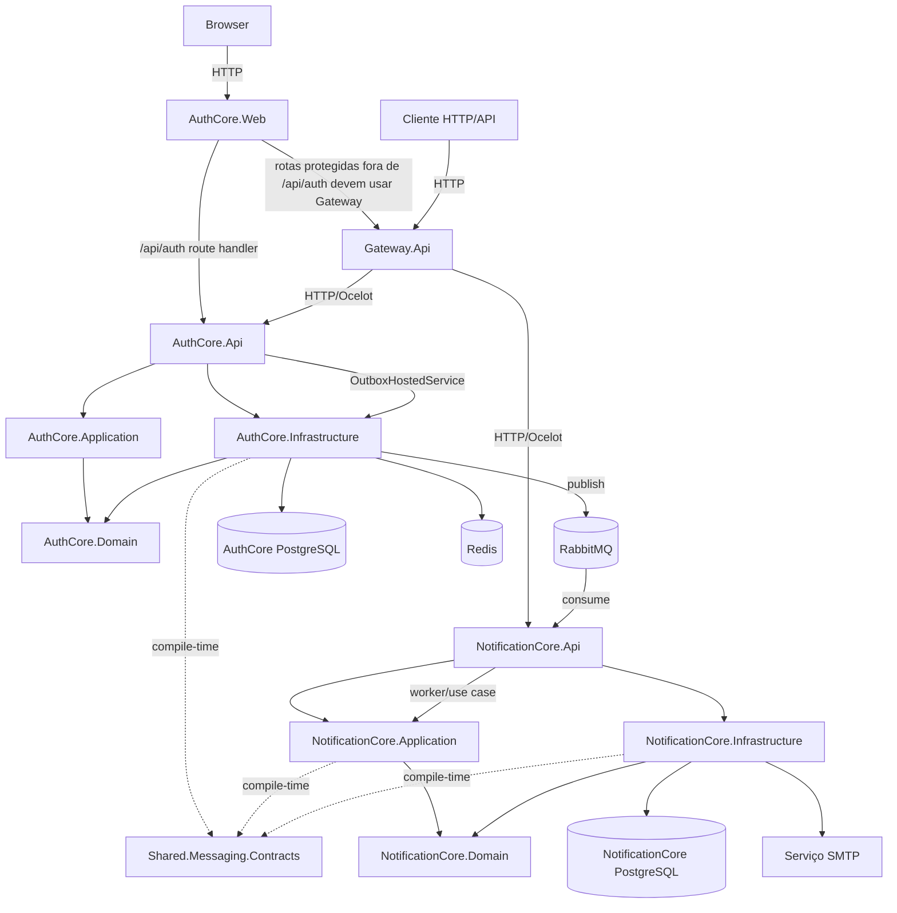

<div align="center">

# AuthCore

<p>
  
  
  
  
  
</p>

### [Back-end](src/Backend/README.md) - [Front-end](src/Frontend/AuthCore.Web/README.md)

</div>

AuthCore é um boilerplate full-stack para autenticação, gestão de usuários e notificações transacionais. A ideia é adotar uma autenticação híbrida, combinando sessão server-side de longa duração como fonte principal de controle, JWT de curta duração como token de acesso usado na maioria das requisições, e cookies HttpOnly para transportar os identificadores/tokens no navegador sem expor o JWT diretamente ao JavaScript do frontend.

O objetivo é combinar controle de revogação e gestão de sessões, boa performance nas requisições comuns, compatibilidade com Gateway e microserviços, menor exposição do token no client-side e possibilidade de bloquear novas emissões de JWT quando a sessão principal for revogada.

## Sumário

- [Funcionalidades](#funcionalidades)
- [Serviços](#serviços)
- [Stacks](#stacks)
- [Arquitetura](#arquitetura)
- [Padrões de engenharia](#padrões-de-engenharia)
- [Instalação](#instalação)
- [Autenticação](#autenticação)
- [Endpoints principais](#endpoints-principais)
- [Testes](#testes)
- [CI/CD e publicação de imagens](#cicd-e-publicação-de-imagens)
- [Estrutura do projeto](#estrutura-do-projeto)
- [Licença](#licença)

## Funcionalidades

- Registro de usuários com validação de dados e senha.
- Verificação de e-mail por código OTP.
- Login por sessão com cookies `HttpOnly`.
- Login token-based com access token JWT e refresh token.
- Autenticação híbrida para Browser/PWA com sessão server-side e JWT curto em cookie `HttpOnly`.
- Renovação e revogação de sessões.
- Logout da sessão atual, logout por token e logout global.
- Listagem e revogação de sessões ativas do usuário.
- Consulta e atualização do perfil autenticado.
- Troca de senha.
- Exclusão de usuário autenticado.
- Rate limiting de rotas sensíveis no Gateway.
- Proteção CSRF para mutações autenticadas por cookie.
- Health checks por serviço.
- Publicação assíncrona de solicitações de notificação pelo AuthCore.
- Consumo, registro, renderização e despacho de notificações transacionais pelo NotificationCore.
- Serviço de e-mail SMTP configurável para envio real de notificações.
- Frontend web com Next.js App Router, sessão por cookie `HttpOnly`, route handlers locais para rotas de autenticação e telas iniciais de login, registro e dashboard privado.

## Serviços

- `Gateway.Api`: API Gateway com Ocelot, autenticação JWT, suporte a JWT via cookie `HttpOnly`, proteção CSRF para mutações por cookie e roteamento para os serviços internos.
- `AuthCore.Api`: serviço de autenticação e usuários.
- `NotificationCore.Api`: serviço de notificações transacionais, templates e envio de e-mail.
- `AuthCore.Web`: frontend web em Next.js para login, registro, sessão por cookie e área autenticada.
- `Shared.Messaging.Contracts`: contratos compartilhados de mensageria e utilitários de payload sensível.

## Stacks

| Camada | Tecnologia | Responsabilidade |
| --- | --- | --- |
| Frontend | Next.js 16 + React 19 + TypeScript 5 | Interface web, rotas locais de autenticação e experiência autenticada |
| UI | Tailwind CSS v4 + shadcn/ui + lucide-react | Estilização, componentes visuais e ícones |
| Backend | .NET 10 + ASP.NET Core Web API | APIs, autenticação, usuários, notificações e regras de negócio |
| Gateway | Ocelot | Roteamento, borda pública, rate limiting e proteção de rotas |
| Banco | PostgreSQL 17 + Npgsql | Persistência principal dos contextos AuthCore e NotificationCore |
| Cache | Redis 7 | Armazenamento técnico para sessões e suporte à autenticação |
| Mensageria | RabbitMQ 3 | Comunicação assíncrona entre AuthCore e NotificationCore |
| E-mail | Serviço SMTP configurável | Envio real de notificações por provedor definido no ambiente |
| Infra local | Docker + Docker Compose | Ambiente local de desenvolvimento e execução dos serviços |
| Migrações | FluentMigrator | Versionamento e aplicação de mudanças no banco |
| Segurança | BCrypt.Net + JWT Bearer Authentication | Hash de senhas e autenticação por token |
| Testes e documentação | xUnit + Swagger/OpenAPI | Testes automatizados e documentação interativa das APIs |
| Pacotes frontend | pnpm | Instalação e gerenciamento de dependências web |

## Arquitetura

A solução organiza serviços backend com separação de responsabilidades e camadas internas por contexto de negócio. A evolução do código segue Clean Architecture, DDD tático e princípios SOLID para manter baixo acoplamento, alta testabilidade e responsabilidades claras.


```mermaid
flowchart TD
    Browser[Browser] -->|HTTP| Web[AuthCore.Web]
    Web -->|/api/auth route handler| AuthApi
    Web -->|rotas protegidas fora de /api/auth devem usar Gateway| Gateway
    Client[Cliente HTTP/API] -->|HTTP| Gateway[Gateway.Api]
    Gateway -->|HTTP/Ocelot| AuthApi[AuthCore.Api]
    Gateway -->|HTTP/Ocelot| NotificationApi[NotificationCore.Api]

    AuthApi --> AuthApplication[AuthCore.Application]
    AuthApi --> AuthInfrastructure[AuthCore.Infrastructure]
    AuthApplication --> AuthDomain[AuthCore.Domain]
    AuthInfrastructure --> AuthDomain

    NotificationApi --> NotificationApplication[NotificationCore.Application]
    NotificationApi --> NotificationInfrastructure[NotificationCore.Infrastructure]
    NotificationApplication --> NotificationDomain[NotificationCore.Domain]
    NotificationInfrastructure --> NotificationDomain

    AuthInfrastructure -. compile-time .-> Contracts[Shared.Messaging.Contracts]
    NotificationApplication -. compile-time .-> Contracts
    NotificationInfrastructure -. compile-time .-> Contracts

    AuthApi -->|OutboxHostedService| AuthInfrastructure
    AuthInfrastructure -->|publish| RabbitMQ[(RabbitMQ)]
    RabbitMQ -->|consume| NotificationApi
    NotificationApi -->|worker/use case| NotificationApplication

    AuthInfrastructure --> AuthPostgres[(AuthCore PostgreSQL)]
    AuthInfrastructure --> Redis[(Redis)]

    NotificationInfrastructure --> NotificationPostgres[(NotificationCore PostgreSQL)]
    NotificationInfrastructure --> SMTP[Serviço SMTP]
```

Responsabilidades principais:

- `Gateway.Api`: borda pública em Docker Compose, roteamento, rate limiting, validação JWT para rotas protegidas e suporte ao fluxo Browser/PWA com JWT em cookie `HttpOnly`.
- `AuthCore.Web`: frontend Next.js com App Router, telas de autenticação, dashboard privado, proxy de navegação por cookie e route handlers locais para chamadas ao AuthCore.
- `AuthCore.Api`: controllers HTTP, contratos JSON, autenticação, autorização, Swagger e health checks.
- `AuthCore.Application`: orquestração dos casos de uso de autenticação e usuários.
- `AuthCore.Domain`: agregados, entidades, value objects, invariantes, eventos e contratos centrais de autenticação.
- `AuthCore.Infrastructure`: persistência PostgreSQL, Redis, criptografia, tokens, migrações, Outbox e publicação RabbitMQ.
- `NotificationCore.Api`: controllers HTTP administrativos, contratos JSON, Swagger e health checks.
- `NotificationCore.Application`: orquestração de consultas, busca e solicitações de envio de notificações.
- `NotificationCore.Domain`: entidades, value objects, enums e regras de notificação.
- `NotificationCore.Infrastructure`: persistência PostgreSQL, consumo RabbitMQ, Inbox, templates, renderização e envio SMTP.
- `Shared.Messaging.Contracts`: mensagens compartilhadas entre serviços.
- `tests`: testes unitários de domínio, aplicação e testes de integração por serviço.

## Padrões de engenharia

O projeto adota SOLID como padrão transversal de design e revisão técnica:

- SRP: classes, controllers, use cases e repositórios devem ter um motivo principal para mudar.
- OCP: variações reais de comportamento devem ser tratadas por abstrações, policies, strategies, factories ou providers, sem concentrar branches em classes centrais.
- LSP: implementações devem cumprir integralmente os contratos que expõem, sem métodos artificiais ou `NotSupportedException`.
- ISP: interfaces devem ser pequenas e orientadas ao consumidor.
- DIP: `Application` e `Domain` dependem de abstrações; detalhes técnicos ficam em `Infrastructure`.

Como regra de visibilidade, abstrações consumidas entre camadas podem ser públicas, enquanto implementações concretas devem ser `internal` por padrão, exceto contratos de entrada, tipos de domínio e exigências técnicas de frameworks.

O guia completo fica em `docs/agents/solid-guidelines.md`. Ele complementa os padrões de arquitetura, estilo C#, contratos HTTP, persistência e testes em `docs/agents/`.

## Instalação

Clone o repositório e acesse a pasta do projeto:

```bash
git clone <url-do-repositorio>
cd auth-core-microservices
```

Restaure as dependências:

```bash
dotnet restore AuthCore.sln
```

Compile a solução:

```bash
dotnet build AuthCore.sln
```

Instale as dependências do frontend:

```bash
cd src/Frontend/AuthCore.Web
pnpm install
```
### Executar o frontend AuthCore.Web

Em outro terminal, execute:

```bash
cd src/Frontend/AuthCore.Web
pnpm dev --hostname 127.0.0.1 --port 3000
```

O frontend fica disponível em:

```text
http://127.0.0.1:3000
```

Por padrão, o route handler local do frontend encaminha `/api/auth/...` para:

```text
http://localhost:5012

```

Serviços padrão em desenvolvimento:

| Serviço | Host | Porta |
| --- | --- | --- |
| AuthCore.Web | `127.0.0.1` | `3000` |
| Gateway Docker | `localhost` | `8080` |
| AuthCore Docker | `localhost` | `8081` |
| AuthCore local | `localhost` | `5012` |
| PostgreSQL AuthCore | `localhost` | `5432` |
| PostgreSQL NotificationCore | `localhost` | `5433` |
| Redis | `localhost` | `6379` |
| RabbitMQ | `localhost` | `5672` |
| RabbitMQ Management | `localhost` | `15672` |

## Autenticação

O projeto suporta três modalidades principais de autenticação:

- login web com sessão autenticada;
- login token-based para clientes API e mobile;
- login com Google para o fluxo web.

As credenciais OAuth do Google devem ser fornecidas por ambiente e nunca versionadas. Para detalhes operacionais, fluxo manual e validações da feature, consulte a documentação em `docs/features/google-login/`.

O frontend `AuthCore.Web` usa o fluxo web por cookie `HttpOnly`. O `src/proxy.ts` faz apenas redirecionamento rápido por presença do cookie de sessão; a validação real de autenticação, autorização, CSRF e sessão permanece no AuthCore e no Gateway.

## Endpoints principais

Quando a aplicação completa está em Docker, prefira acessar as rotas publicadas pelo Gateway em `http://localhost:8080`.

| Contexto | Rotas principais | Responsabilidade |
| --- | --- | --- |
| AuthCore | `/api/auth/*`, `/api/users/*` | Autenticação, sessões, tokens e perfil do usuário |
| NotificationCore | `/api/notifications/*` | Consulta e envio de notificações transacionais |
| Gateway | `/health`, `/authcore/health`, `/notificationcore/health` | Entrada pública, roteamento e health checks agregados |

Os exemplos de chamadas HTTP, rotas canônicas e detalhes dos controllers ficam no [README do Backend](src/Backend/README.md).

## Testes

Execute todos os testes da solução:

```bash
./run.sh test
```

Ou diretamente com o .NET CLI:

```bash
dotnet test AuthCore.sln
```

Para executar testes por área:

```bash
dotnet test tests/AuthCore.Domain.UnitTests/AuthCore.Domain.UnitTests.csproj
dotnet test tests/AuthCore.Application.UnitTests/AuthCore.Application.UnitTests.csproj
dotnet test tests/AuthCore.IntegrationTests/AuthCore.IntegrationTests.csproj
dotnet test tests/NotificationCore.Domain.UnitTests/NotificationCore.Domain.UnitTests.csproj
dotnet test tests/NotificationCore.Application.UnitTests/NotificationCore.Application.UnitTests.csproj
dotnet test tests/NotificationCore.IntegrationTests/NotificationCore.IntegrationTests.csproj
dotnet test tests/Gateway.IntegrationTests/Gateway.IntegrationTests.csproj
```

Para validar o frontend:

```bash
cd src/Frontend/AuthCore.Web
pnpm lint
pnpm build
```

## CI/CD e publicação de imagens

O monorepo possui workflows para validação e publicação:

- Backend CI: valida restore, build, testes, publish de artifacts e Docker build dos serviços backend.
- Web CI: valida instalação, lint, build Next.js e Docker build do frontend.
- Docker Publish: publica imagens Docker versionadas no GitHub Container Registry (GHCR).

Imagens publicadas:

- `ghcr.io/brunopsouz/authcore-api`
- `ghcr.io/brunopsouz/notificationcore-api`
- `ghcr.io/brunopsouz/gateway-api`
- `ghcr.io/brunopsouz/authcore-web`

O processo atual publica imagens para uso futuro, mas ainda não faz deploy automático, staging ou produção.

Consulte o processo detalhado em [docs/ci-cd/release-process.md](docs/ci-cd/release-process.md).

## Estrutura do projeto

```text
.
├── AuthCore.sln
├── run.sh
├── src
│   ├── Backend
│   │   ├── docker-compose.yml
│   │   ├── AuthCore
│   │   │   ├── AuthCore.Api
│   │   │   ├── AuthCore.Application
│   │   │   ├── AuthCore.Domain
│   │   │   └── AuthCore.Infrastructure
│   │   ├── Gateway
│   │   │   └── Gateway.Api
│   │   └── NotificationCore
│   │       ├── NotificationCore.Api
│   │       ├── NotificationCore.Application
│   │       ├── NotificationCore.Domain
│   │       └── NotificationCore.Infrastructure
│   ├── Shared
│   │   └── Messaging.Contracts
│   └── Frontend
│       └── AuthCore.Web
└── tests
    ├── AuthCore.Application.UnitTests
    ├── AuthCore.Domain.UnitTests
    ├── AuthCore.IntegrationTests
    ├── Gateway.IntegrationTests
    ├── NotificationCore.Application.UnitTests
    ├── NotificationCore.Domain.UnitTests
    └── NotificationCore.IntegrationTests
```

## Licença

Este projeto está licenciado sob a licença MIT. Consulte o arquivo [LICENSE](LICENSE) para mais detalhes.
